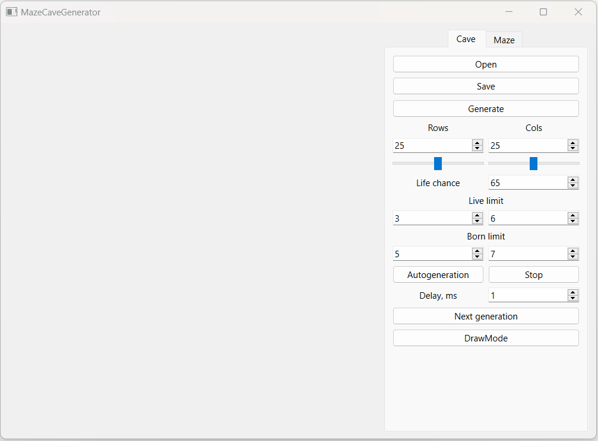
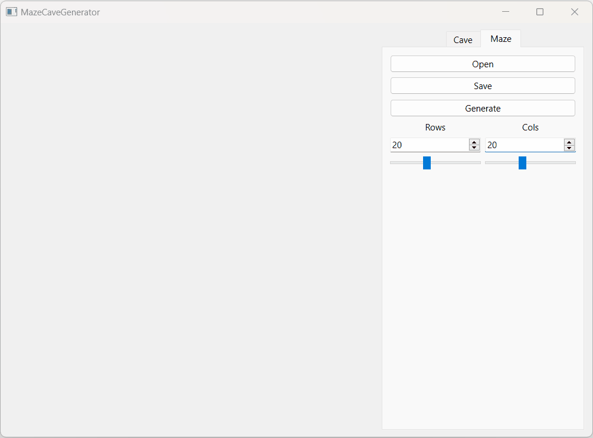

# MazeCaveGenerator
Implementation of maze and cave generators. Also has some extended features like solving and etc. 
## Features
- Open/Save for special maze/cave format type text
An example of such a file for maze(upper matrix right walls, lower matrix bottom walls):
```
4 4
0 0 0 1
1 0 1 1
0 1 0 1
0 0 0 1

1 0 1 0
0 0 1 0
1 1 0 1
1 1 1 1
```

Example for cave:
```
4 4
0 1 0 1
1 0 0 1
0 1 0 0
0 0 1 1
```
- Generate cave or maze by size and additional parameters

- Solve Maze by clicking on start and finish on the drown map

- Draw ur own cave by just clicking on the drown map
